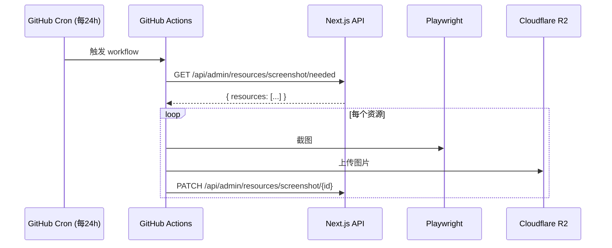

# 📸 Screenshot Service

基于 **GitHub Actions + Playwright** 的批量网站截图服务，用于替代 Cloudflare Worker 方案。

## 特性

- ✅ **完全免费** - 公共仓库无限执行时间
- ✅ **单次无限制** - 相比 Worker 的 3 个限制
- ✅ **API 兼容** - 复用现有 Next.js 端点，无需修改
- ✅ **多种触发方式** - 定时、手动、API 触发

## 架构



## 配置指南

### 1. 准备工作

在 GitHub 上创建一个新仓库（建议设为 **Public** 以获得 Actions 无限执行时间，Secrets 是安全的）。

### 2. 获取 Cloudflare 凭据

为了让 GitHub Actions 能够访问 R2 和上传图片，你需要准备以下参数：

#### 🔹 账户 ID (R2_ACCOUNT_ID)
1. 登录 [Cloudflare 控制面板](https://dash.cloudflare.com/)。
2. 在浏览器地址栏 URL 中查找：`dash.cloudflare.com/` 后面那一串 **32 位字母和数字**。
3. 或者在左侧菜单进入 **R2**，右侧边栏会显示 **Account ID**。

#### 🔹 R2 API 令牌 (R2_ACCESS_KEY_ID & R2_SECRET_ACCESS_KEY)
1. 进入 Cloudflare **R2** 页面。
2. 点击右侧的 **Manage R2 API Tokens**。
3. 点击 **Create API token**。
   - **Token name**: 建议叫 `github-actions-screenshot`。
   - **Permissions**: 选择 **Object Read & Write** (必选)。
   - **Bucket scope**: 选择 **Specific buckets only**，勾选你的截图存储桶。
4. 点击 **Create API Token**。
5. **保存结果**：
   - **Access Key ID** -> 对应 `R2_ACCESS_KEY_ID`
   - **Secret Access Key** -> 对应 `R2_SECRET_ACCESS_KEY` (注意：只显示一次)。

#### 🔹 公共访问地址 (R2_PUBLIC_URL)
- 这是你的图片 CDN 基础 URL。
- 如果你在存储桶的 **Settings -> Public Access** 中绑定了域名，填入绑定域名（如 `https://images.example.com`）。
- 如果没有，使用 Cloudflare 提供的 `https://pub-xxx.r2.dev` 地址。

### 3. 配置 GitHub Secrets

进入你的 GitHub 仓库 **Settings → Secrets and variables → Actions**，点击 **New repository secret**，添加以下 7 个密钥：

| Secret 名称 | 来源 | 说明 |
|------------|------|------|
| `R2_ACCOUNT_ID` | Cloudflare 控制台 | 32 位账户 ID |
| `R2_ACCESS_KEY_ID` | API Token 页面 | R2 访问 ID |
| `R2_SECRET_ACCESS_KEY` | API Token 页面 | R2 访问密钥 |
| `R2_BUCKET_NAME` | 你的配置 | 存储桶名称 |
| `R2_PUBLIC_URL` | 你的配置 | CDN 基础 URL (含 https://) |
| `API_BASE_URL` | 你的配置 | Next.js 应用公网地址 |
| `DATABASE_API_KEY` | 你的配置 | 原 Worker 使用的 API 通信密钥 |

### 4. 启用 Actions

默认情况下，手动触发的工作流可能需要启用。进入仓库 **Settings → Actions → General**，确保选择了 **Allow all actions and reusable workflows**。


## 触发方式

### 定时触发（自动）

每天 UTC 00:00（北京时间 08:00）自动执行。

### 手动触发

1. 进入 GitHub 仓库 **Actions** 页面
2. 选择 **Screenshot Batch** workflow
3. 点击 **Run workflow**

### API 触发（Next.js 调用）

```typescript
// 在 Next.js 应用中调用
await fetch(
  `https://api.github.com/repos/${owner}/${repo}/dispatches`,
  {
    method: 'POST',
    headers: {
      Authorization: `Bearer ${GITHUB_TOKEN}`,
      Accept: 'application/vnd.github.v3+json',
    },
    body: JSON.stringify({
      event_type: 'screenshot_request',
    }),
  }
);
```

## 本地开发

### 安装依赖

```bash
npm install
npx playwright install chromium
```

### 测试单个 URL

```bash
npm run test:single -- https://example.com
```

截图将保存为 `test-screenshot.jpg`。

### 完整流程测试

需要配置环境变量：

```bash
export API_BASE_URL=https://design.example.com
export DATABASE_API_KEY=your-api-key
export R2_ACCOUNT_ID=your-account-id
export R2_ACCESS_KEY_ID=your-access-key
export R2_SECRET_ACCESS_KEY=your-secret-key
export R2_BUCKET_NAME=your-bucket
export R2_PUBLIC_URL=https://images.example.com

npm start
```

## 截图配置

与现有 Cloudflare Worker 保持一致：

| 配置项 | 值 | 说明 |
|-------|-----|------|
| 视口尺寸 | 1200×800 | 截图分辨率 |
| 图片格式 | JPEG | 兼容性好 |
| 图片质量 | 80 | 压缩率 |
| 页面超时 | 30 秒 | 页面加载超时 |
| 渲染等待 | 3 秒 | 页面渲染稳定等待 |

## 复用的 API 端点

| 端点 | 方法 | 说明 |
|------|------|------|
| `/api/admin/resources/screenshot/needed` | GET | 获取待截图资源 |
| `/api/admin/resources/screenshot/[id]` | PATCH | 回填截图结果 |

## 迁移步骤

1. 部署此仓库到 GitHub
2. 配置 Secrets
3. 手动触发 workflow 验证
4. 停用 Cloudflare Worker

## License

MIT
