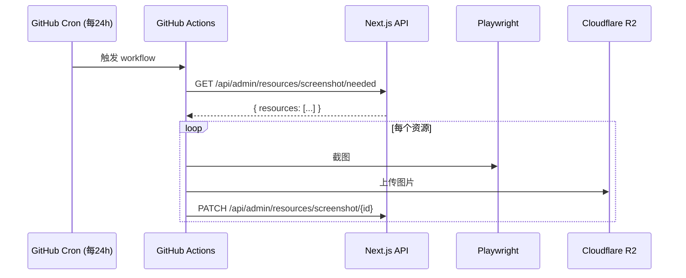

# 📸 Screenshot Service

基于 **GitHub Actions + Playwright** 的批量网站截图服务，用于替代 Cloudflare Worker 方案。

## 特性

- ✅ **完全免费** - 公共仓库无限执行时间
- ✅ **单次无限制** - 相比 Worker 的 3 个限制
- ✅ **API 兼容** - 复用现有 Next.js 端点，无需修改
- ✅ **多种触发方式** - 定时、手动、API 触发

## 架构



## 配置

### 1. 创建仓库

```bash
# 克隆并推送到你的 GitHub
git clone <this-repo>
cd snapshot
git remote set-url origin https://github.com/<your-username>/snapshot.git
git push -u origin main
```

### 2. 配置 Secrets

在 GitHub 仓库 **Settings → Secrets and variables → Actions** 中添加：

| Secret 名称 | 说明 | 示例值 |
|------------|------|--------|
| `R2_ACCOUNT_ID` | Cloudflare 账户 ID | `abc123...` |
| `R2_ACCESS_KEY_ID` | R2 访问密钥 ID | `abc123...` |
| `R2_SECRET_ACCESS_KEY` | R2 密钥 | `secret...` |
| `R2_BUCKET_NAME` | R2 存储桶名称 | `screenshots` |
| `R2_PUBLIC_URL` | R2 公共访问 URL | `https://images.example.com` |
| `API_BASE_URL` | Next.js 应用地址 | `https://design.example.com` |
| `DATABASE_API_KEY` | API 鉴权密钥 | `sb_secret_...` |

### 3. 启用 Actions

确保仓库 **Settings → Actions → General** 中启用 Actions。

## 触发方式

### 定时触发（自动）

每天 UTC 00:00（北京时间 08:00）自动执行。

### 手动触发

1. 进入 GitHub 仓库 **Actions** 页面
2. 选择 **Screenshot Batch** workflow
3. 点击 **Run workflow**

### API 触发（Next.js 调用）

```typescript
// 在 Next.js 应用中调用
await fetch(
  `https://api.github.com/repos/${owner}/${repo}/dispatches`,
  {
    method: 'POST',
    headers: {
      Authorization: `Bearer ${GITHUB_TOKEN}`,
      Accept: 'application/vnd.github.v3+json',
    },
    body: JSON.stringify({
      event_type: 'screenshot_request',
    }),
  }
);
```

## 本地开发

### 安装依赖

```bash
npm install
npx playwright install chromium
```

### 测试单个 URL

```bash
npm run test:single -- https://example.com
```

截图将保存为 `test-screenshot.jpg`。

### 完整流程测试

需要配置环境变量：

```bash
export API_BASE_URL=https://design.example.com
export DATABASE_API_KEY=your-api-key
export R2_ACCOUNT_ID=your-account-id
export R2_ACCESS_KEY_ID=your-access-key
export R2_SECRET_ACCESS_KEY=your-secret-key
export R2_BUCKET_NAME=your-bucket
export R2_PUBLIC_URL=https://images.example.com

npm start
```

## 截图配置

与现有 Cloudflare Worker 保持一致：

| 配置项 | 值 | 说明 |
|-------|-----|------|
| 视口尺寸 | 1200×800 | 截图分辨率 |
| 图片格式 | JPEG | 兼容性好 |
| 图片质量 | 80 | 压缩率 |
| 页面超时 | 30 秒 | 页面加载超时 |
| 渲染等待 | 3 秒 | 页面渲染稳定等待 |

## 复用的 API 端点

| 端点 | 方法 | 说明 |
|------|------|------|
| `/api/admin/resources/screenshot/needed` | GET | 获取待截图资源 |
| `/api/admin/resources/screenshot/[id]` | PATCH | 回填截图结果 |

## 迁移步骤

1. 部署此仓库到 GitHub
2. 配置 Secrets
3. 手动触发 workflow 验证
4. 停用 Cloudflare Worker

## License

MIT
