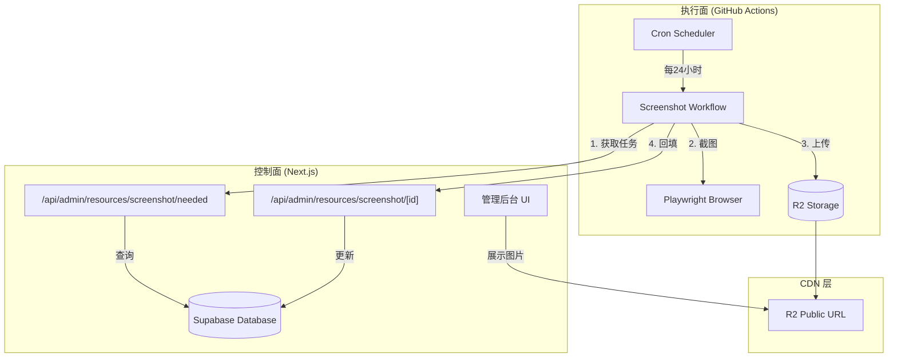
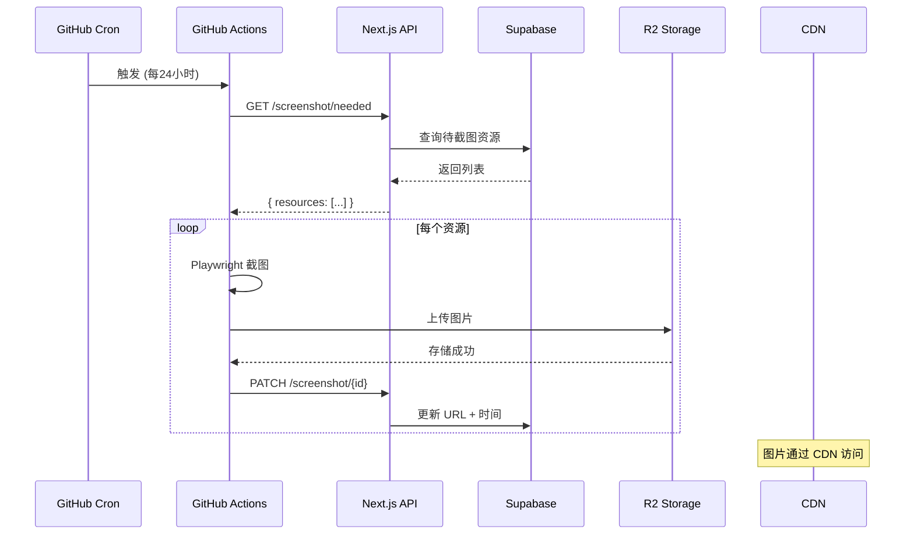

# 截图服务架构说明 (Screenshot Service Architecture)

## 概述

设计百宝箱的截图服务采用 **GitHub Actions + Playwright** 方案，实现批量网站截图的自动化处理。

> **注意**: 此方案替代了原有的 Cloudflare Worker 方案，复用现有 Next.js API 端点，实现无缝迁移。



---

## 新旧方案对比

| 维度 | Cloudflare Worker (旧) | GitHub Actions (新) |
|------|------------------------|---------------------|
| **成本** | 免费额度有限 | ✅ 完全免费 |
| **单次处理量** | 最多 3 个 | ✅ 无限制 |
| **触发频率** | 每 15 分钟 | 每 24 小时 |
| **执行时间** | 30 秒超时 | ✅ 最长 6 小时 |
| **截图引擎** | Puppeteer | Playwright |
| **API 兼容** | - | ✅ 完全兼容 |

---

## 核心组件详解

### 1. GitHub Actions Workflow (执行面)

**文件**: [.github/workflows/screenshot.yml](file:///.github/workflows/screenshot.yml)

#### 1.1 触发方式

| 触发方式 | 说明 |
|---------|------|
| **定时任务** | 每天 UTC 00:00（北京时间 08:00） |
| **手动触发** | GitHub Actions 页面点击 "Run workflow" |
| **API 触发** | `repository_dispatch` 事件 |

#### 1.2 核心流程

```
1. 调用 Next.js API 获取待处理资源
   GET /api/admin/resources/screenshot/needed
   ↓
2. 启动 Playwright 浏览器
   ↓
3. 循环处理每个资源（无上限）
   ├── 打开页面、设置视口
   ├── 等待页面加载 (networkidle + 3秒)
   ├── 截图 (JPEG, 质量 80)
   ├── 上传到 R2 存储
   └── 回填截图 URL 到数据库
   ↓
4. 关闭浏览器
```

#### 1.3 关键配置

| 配置项 | 值 | 说明 |
|-------|-----|------|
| `SCREENSHOT_TIMEOUT` | 30000ms | 页面加载超时 |
| `WAIT_AFTER_LOAD` | 3000ms | 渲染稳定等待 |
| `VIEWPORT_CONFIG` | 1200×800 | 截图分辨率 |
| `JPEG_QUALITY` | 80 | 图片质量 |
| 单次处理上限 | **无限制** | 大幅提升 |

---

### 2. Next.js API 端点 (控制面)

#### 2.1 获取待截图资源

**端点**: `GET /api/admin/resources/screenshot/needed`

**过滤条件**:
```sql
screenshot_url IS NULL          -- 从未截图
OR
screenshot_updated_at < NOW() - 7 days  -- 截图已过期
```

**响应格式**:
```json
{
  "success": true,
  "total": 3,
  "resources": [
    { "id": "uuid", "url": "https://..." }
  ]
}
```

---

#### 2.2 更新截图信息

**端点**: `PATCH /api/admin/resources/screenshot/[id]`

**支持字段**:
| 字段 | 类型 | 说明 |
|-----|------|------|
| `screenshotUrl` | string | 截图 CDN URL |
| `screenshotUpdatedAt` | ISO8601 | 更新时间 |
| `screenshotError` | string | 错误信息（失败时） |

**更新逻辑**:
- 成功时：设置 URL + 时间，清空 error
- 失败时：记录 error（截断到 500 字符）

---

## 数据流图



---

## 环境变量配置

### GitHub Secrets

| 变量名 | 用途 |
|-------|------|
| `R2_ACCOUNT_ID` | Cloudflare 账户 ID |
| `R2_ACCESS_KEY_ID` | R2 访问密钥 ID |
| `R2_SECRET_ACCESS_KEY` | R2 密钥 |
| `R2_BUCKET_NAME` | R2 存储桶名称 |
| `R2_PUBLIC_URL` | R2 公共 CDN URL |
| `API_BASE_URL` | Next.js API 地址 |
| `DATABASE_API_KEY` | 通信密钥 |

---

## 安全设计

### API 鉴权

```
GitHub Actions → API: Bearer ${DATABASE_API_KEY}
```

---

## 数据库字段

`resources` 表相关字段：

| 字段 | 类型 | 说明 |
|-----|------|------|
| `screenshot_url` | text | 截图 CDN URL |
| `screenshot_updated_at` | timestamp | 最后更新时间 |
| `screenshot_error` | text | 错误信息 (最长500字符) |

---

## 项目文件索引

| 文件 | 职责 |
|-----|------|
| [.github/workflows/screenshot.yml](.github/workflows/screenshot.yml) | GitHub Actions 工作流 |
| [src/index.ts](src/index.ts) | 主入口，协调整个流程 |
| [src/screenshot.ts](src/screenshot.ts) | Playwright 截图逻辑 |
| [src/r2.ts](src/r2.ts) | R2 上传模块 |
| [src/api.ts](src/api.ts) | Next.js API 调用 |
| [src/test-single.ts](src/test-single.ts) | 单个 URL 测试脚本 |

---

## 迁移指南

1. **部署此仓库** - 推送到 GitHub
2. **配置 Secrets** - 添加 R2 和 API 密钥
3. **手动测试** - 触发 workflow 验证
4. **停用 Worker** - 删除 Cloudflare Worker cron 触发器

---

## 已知限制

1. **定时精度**：GitHub Actions 的 cron 可能有几分钟延迟
2. **网络位置**：GitHub runners 在海外，部分国内网站可能加载慢
3. **公开仓库**：工作流配置可见（但 Secrets 是安全的）
