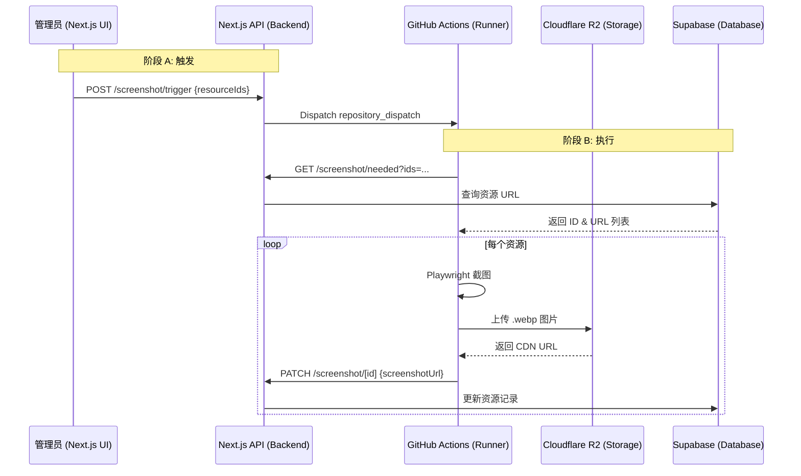

# 截图服务架构与数据流文档

本文档详细说明了 Design Treasure Box 项目中截图服务的全链路交互流程、数据流向及接口规范。

## 1. 架构概述

为了平衡成本、性能与可靠性，截图服务从传统的 Cloudflare Workers 迁移到了 **GitHub Actions**。

- **控制面 (Control Plane)**: Next.js 应用（管理后台、API 端点）。
- **执行面 (Execution Plane)**: GitHub Actions 工作流（运行 Playwright 浏览器，生成截图）。
- **存储层 (Storage Layer)**: 
  - **Cloudflare R2**: 存储图片二进制文件（CDN 访问）。
  - **Supabase**: 存储图片 URL、更新时间及状态。

---

## 2. 核心组件交互流程

截图过程分为两个阶段：**触发阶段** 和 **生成与更新阶段**。

### 阶段 A：触发阶段 (Trigerring)

这通常通过管理员在后台手动触发，或通过定时任务（GitHub Cron）触发。

1. **管理员操作**: 在 Admin UI 中点击“立即生成”或“重试失败”。
2. **前端调用**: 管理后台调用 API `POST /api/admin/resources/screenshot/trigger`。
3. **后端分发**: 
   - Next.js 验证管理员权限。
   - 调用 GitHub API 的 `repository_dispatch` 事件。
   - Payload 中携带 `resourceIds`（如果是指定截图）或为空（如果是批量扫描）。
4. **GA 启动**: GitHub Actions 监测到 `screenshot_request` 事件，启动 Runner。

### 阶段 B：生成与更新阶段 (Execution)

GitHub Action 启动后，会反向调用 Next.js API 获取任务并上报结果。

1. **获取任务**: GitHub Action 调用 `GET /api/admin/resources/screenshot/needed` 获取需要截图的资源列表。
   - 如果触发时传了 `ids`，则只获取这些资源。
   - 否则，获取前 10 个 `screenshot_url` 为空或已过期的资源。
2. **执行截图**: GitHub Action 遍历资源列表，使用 Playwright 访问资源网站并截图。
3. **上传存储**: 将截图上传至 Cloudflare R2，获取公共访问 URL。
4. **上报状态**:
   - **成功**: 调用 `PATCH /api/admin/resources/screenshot/[id]` 更新 `screenshot_url`。
   - **失败**: 调用 `PATCH /api/admin/resources/screenshot/[id]` 记录 `screenshot_error`。

---

## 3. 数据流向图



---

## 4. 接口规范 (API Reference)

### 4.1 触发截图
- **Endpoint**: `POST /api/admin/resources/screenshot/trigger`
- **Auth**: 管理员会话 或 `DATABASE_API_KEY`
- **Body**:
  ```json
  {
    "resourceIds": ["uuid1", "uuid2"] // 非必填，仅手动触发指定资源时使用
  }
  ```

### 4.2 获取待截图列表
- **Endpoint**: `GET /api/admin/resources/screenshot/needed`
- **Auth**: `DATABASE_API_KEY`
- **Params**: `ids=id1,id2` (可选)
- **Response**:
  ```json
  {
    "success": true,
    "resources": [{ "id": "...", "url": "..." }]
  }
  ```

### 4.3 更新截图结果
- **Endpoint**: `PATCH /api/admin/resources/screenshot/[id]`
- **Auth**: `DATABASE_API_KEY`
- **Body**:
  ```json
  {
    "screenshotUrl": "https://cdn.example.com/xxx.webp",
    "screenshotError": null, // 或者错误短语
    "screenshotUpdatedAt": "2026-01-21T..."
  }
  ```

---

## 5. 安全与鉴权

- **双重校验**: 
  - 外部请求（如来自 GA）必须在 Header 中携带 `Authorization: Bearer ${DATABASE_API_KEY}`。
  - 管理后台请求则复用管理员 Session。
- **环境变量**:
  - `GITHUB_TOKEN`: 用于触发 GA。
  - `DATABASE_API_KEY`: 用于内部 API 相互调用。
  - `R2_ACCESS_KEY_ID/SECRET`: 用于 GA 上传图片。

## 6. 异常处理

- **超时**: Playwright 截图设置了 30s 超时，防止单个任务阻塞。
- **重试**: 管理后台会统计失败次数，管理员可以一键重试所有失败的截图请求。
- **更新保护**: 如果截图生成的 URL 无法访问，数据库将保持原有状态或记录错误。

---

## 7. 方案调整计划 (2026-01-21)

基于最新的业务需求，截图服务将进行以下逻辑优化：

### 7.1 核心逻辑调整
1.  **任务抓取策略**：
    *   **精准模式 (Passed IDs)**：当管理员指定具体资源 ID 时，系统将**无视**该资源当前的截图状态（即使已存在且未过期），强制重新抓取。此操作不再受限于单次 10 条的限制。
    *   **深度模式 (No IDs / Full Mode)**：若未指定 ID，系统将采用“**单次运行·分批迭代**”策略。API 每次返回固定规模的安全批次（如 50 条），GA 脚本在处理完当前批次后会**立即自动请求下一批次**。
    *   **清空策略 (Until-Empty Logic)**：这种模式下，一次触发即代表“清空所有积压”。GA 脚本将持续循环：`获取任务 -> 处理 -> 回传 -> 再次获取`，直到 API 返回空列表。这确保了在单次 GitHub Actions 运行窗口内（最高 6 小时），能够平稳、完整地处理成百上千个封面记录，而不会因单次 API 请求过载导致崩溃。

2.  **执行稳定性控制**：
    *   **异常隔离与续航**：截图循环中，单个资源的失败将被隔离。即便某个资源因坏链导致截图失败，上报错误后系统会**瞬间启动下一个任务**。
    *   **失败重试保护**：对于标记为失败的资源，只有下一次管理员手动“重试”或等到下一个全量更新周期时才会再次处理，防止坏链在同一个循环内死循环。

### 7.2 场景覆盖
*   **一键全清**：管理员在后台点击“全量同步” -> GA 启动循环爬取 -> 遍历完所有缺失或过期的封面 -> 任务结束。
*   **手动强更**：管理员指定 1 个或多个 ID -> GA 优先处理这几个特定任务 -> 处理完后自动结束（不进入深度模式循环）。
*   **自动巡检**：定时任务触发全量模式 -> 自动补齐过去 24 小时内新增或过期的封面。

### 7.3 优化考量 (概要)
*   **接口设计**：API 保持轻量（每次 50 条），GA 脚本控制执行节奏。
*   **运行限制**：设定全局最大循环次数或总耗时阈值（如 5 小时），确保在 GitHub Actions 强制杀掉进程前优雅结束并保留进度。
*   **资源排序**：始终优先抓取“从未生成过截图”的最急迫资源。

